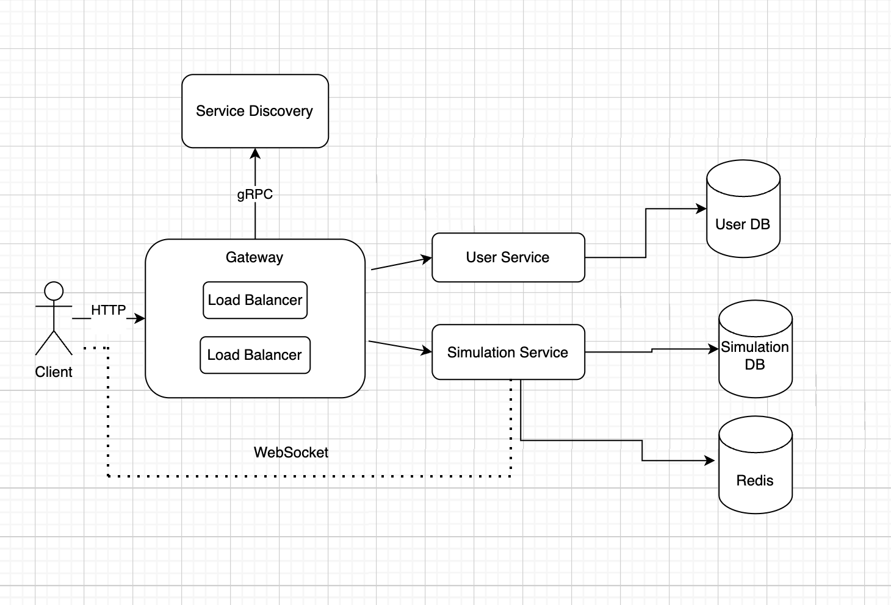

# UnoLingo

#### Ceban Andrei, FAF-211

## Application Suitability
The following system is suitable for the following reasons:

* The Learning Session Service is essential and flexible as it manages core functionalities like matching users with native speakers or tutors, handling conversation sessions (text, voice, or video), and providing real-time feedback during language practice (such as pronunciation correction, vocabulary tips, or grammar suggestions).

* Growing Demand for Language Learning: With increasing globalization, the need to learn new languages for travel, work, or personal growth has surged. Online learning platforms have become a preferred method for language acquisition due to their flexibility and accessibility.

* Real-time Interactions are Critical: Language learning thrives on conversation and immediate feedback. Unlike traditional self-paced apps, this platform offers real-time interactions with native speakers, which provides an immersive learning experience essential for mastering speaking and listening skills.

* Convenience and Accessibility: The app connects learners and native speakers from different regions, offering users the ability to practice anytime and anywhere. This is especially valuable in regions where access to in-person language tutors is limited.

## Service boundaries

1. Client - Is a service which interacts with the system by making requests to the Gateway.
2. Gateway Service - The entry point to the system, handling WebSocket connections and routing requests to the Simulation Service and User Service.
3. Service Discovery - Is responsible for maintaining a registry of services and their instances, that way all services can communicate between them.
   or UserService based on the required functionality.
4. User Service - Is responsible for handling user registration, authentification, data management.
5. Simulation Service - Implements the game logic, real-time requests and updates.



## Technology Stack

1. Client
    * React.js framework.
2. Gateway Service
    * Python with FastAPI (building real-time APIs )
    * WebSocket Library: Starlett (ASGI) - for asynchronous operations and real-time features.
3. User Service
    * Programming language - Python / Flask, to manage user actions
    * Database - PostgreSQL
    * Why PostgreSQL ? - For structured relational data making it suitable for authentication and user data management
4. Simulation Service
    * Programming language - Python / Flask
    * Database - MongoDB
    * Why MongoDB ? - For dynamic session data with real-time interaction logs, handling larve volumes od data at hi-speed reads and writes.
    * Redis - For caching ongoing sessions and handling real-time interactions.


## Data Management Design
### User Service:
#### Endpoints:

1. ```POST /api/users/login``` - Authenticate a user.

##### Data:
```json
{
  "email": "string",
  "password": "string"
}
```
##### Response:
```json
{
  "token": "string",
  "message": "Login successful."
}
```

2. ```GET /api/users/profile``` - Retrieve user profile information.

##### Headers:
```json
{
  "token": "string", //Authorization: Bearer <token>
}
```
##### Response:
```json
{
  "user_id": "int",
  "name": "string",
  "email": "string",
  "created_at": "string"
}
```

3. ```PUT /api/users/profile``` -  Update user profile information.

##### Data:
```json
{
  "name": "string",
  "email": "string"
}
```
##### Response:
```json
{
  "user_id": "int",
  "message": "Profile updated successfully."
}
```

4. ```POST /api/users/change-password ``` - Change user password.

##### Data:
```json
{
  "old_password": "string",
  "new_password": "string"
}
```
##### Response:
```json
{
  "user_id": "int",
  "message": "Password changed successfully."
}
```

5. ```POST /api/users/delete ``` - Delete a user account.

##### Headers:
```json
{
  "token": "string", //Authorization: Bearer <token>
}
```
##### Response:
```json
{
  "user_id": "int",
  "message": "User account deleted successfully."
}
```

### Simulator Service:
#### Endpoints:

1. ```POST /api/simulaiton/start-session``` - Start a new simulation session.

##### Data:
```json
{
  "user_id": "int",
  "language_pair": "string",
  "session_type": "text"
}
```
##### Response:
```json
{
  "session_id": "int",
  "message": "Simulation session started successfully."
}
```

2. ```POST /api/simulaiton/send-message``` - Send a message.

##### Data:
```json
{
  "session_id": "int",
  "user_id": "int",
  "message": "string"
}
```
##### Response:
```json
{
  "message_id": "int",
  "timestamp": "string",
  "message": "Message sent successfully."
}
```


3. ```POST /api/simulaiton/end-session``` - End the session.

##### Data:
```json
{
  "session_id": "int",
  "user_id": "int"
}
```
##### Response:
```json
{
  "session_id": "int",
  "message": "Simulation session ended successfully."
}
```


## Deployment & Scaling

* Deployment: Each microservice, including Authentication , will be containerized with Docker. Docker Compose will handle the network setup, enabling communication between services via their names and creating separate environments for each service.

* Scaling: Horizontal scaling will be implemented to deploy additional instances of the Flashcards service during peak usage times. This approach will distribute the load across multiple instances, enhancing performance and optimizing resource utilization.