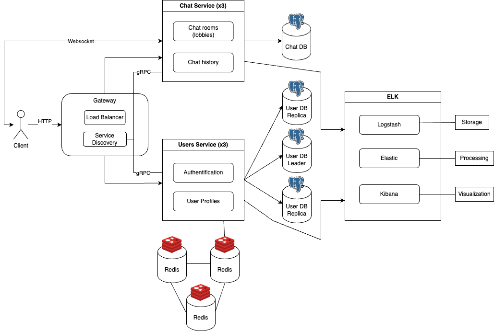

# UnoLingo

#### Ceban Andrei, FAF-211

## Application Suitability
The following system is suitable for the following reasons:

* The Learning Session Service is essential and flexible as it manages core functionalities like matching users with native speakers or tutors, handling conversation sessions (text, voice, or video), and providing real-time feedback during language practice (such as pronunciation correction, vocabulary tips, or grammar suggestions).

* Growing Demand for Language Learning: With increasing globalization, the need to learn new languages for travel, work, or personal growth has surged. Online learning platforms have become a preferred method for language acquisition due to their flexibility and accessibility.

* Real-time Interactions are Critical: Language learning thrives on conversation and immediate feedback. Unlike traditional self-paced apps, this platform offers real-time interactions with native speakers, which provides an immersive learning experience essential for mastering speaking and listening skills.

* Convenience and Accessibility: The app connects learners and native speakers from different regions, offering users the ability to practice anytime and anywhere. This is especially valuable in regions where access to in-person language tutors is limited.

## Service boundaries

1. Client - Is a service which interacts with the system by making requests to the Gateway.
2. Gateway Service - The entry point to the system, handling WebSocket connections and routing requests to the Simulation Service and User Service.
3. Service Discovery - Is responsible for maintaining a registry of services and their instances, that way all services can communicate between them.
   or UserService based on the required functionality.
4. User Service - Is responsible for handling user registration, authentification, data management.
5. Simulation Service - Implements the game logic, real-time requests and updates.



## Technology Stack

1. Client
    * React.js framework.
2. Gateway Service
    * Node.js
    * WebSocket Library: Starlett (ASGI) - for asynchronous operations and real-time features.
3. User Service
    * Programming language - Python / Flask, to manage user actions
    * Database - Sqlite
4. Simulation Service
    * Programming language - Python / Flask
    * Database - Sqlite
    * Redis - For caching ongoing sessions and handling real-time interactions.


## Communication Patterns 

1. RESTful APIs:
    * HTTP communication between external clients and services.

2. gRPC:
    * Communication between services and service discovery.

3. WebSocket:
    * For real-time, bi-directional communication.

## Data Management Design
### User Service:
#### Endpoints:

# Gateway API

This API Gateway serves as a central access point for managing requests between clients and backend services, with rate limiting, request timeout handling, and service discovery functionality.

## Table of Contents

- [Installation](#installation)
- [Endpoints](#endpoints)
  - [Register a New User](#register-a-new-user)
  - [Login and Issue JWT Token](#login-and-issue-jwt-token)
  - [Validate JWT Token](#validate-jwt-token)
  - [Get User Information by ID](#get-user-information-by-id)
  - [Get All Users](#get-all-users)
  - [Gateway Status](#gateway-status)
- [Error Handling](#error-handling)

## Installation

To run the Gateway API, ensure that you have Node.js and Express installed. Install dependencies with:

```bash
npm install
```


Endpoints
1. Register a New User
Endpoint: /gateway/register
Method: POST
Rate Limiting: Max 10 requests per minute per IP
Description: Registers a new user with the authentication service.
Request Body:

json
Copy code
{
    "username": "string",
    "password": "string"
}
Responses:

201 Created: User registered successfully.
429 Too Many Requests: Rate limit exceeded.
504 Gateway Timeout: Request to the auth service timed out.
500 Internal Server Error: Service discovery or auth service failure.

## Deployment & Scaling

* Deployment: Each microservice, including Authentication , will be containerized with Docker. Docker Compose will handle the network setup, enabling communication between services via their names and creating separate environments for each service.

* Scaling: Horizontal scaling will be implemented to deploy additional instances of the Flashcards service during peak usage times. This approach will distribute the load across multiple instances, enhancing performance and optimizing resource utilization.
