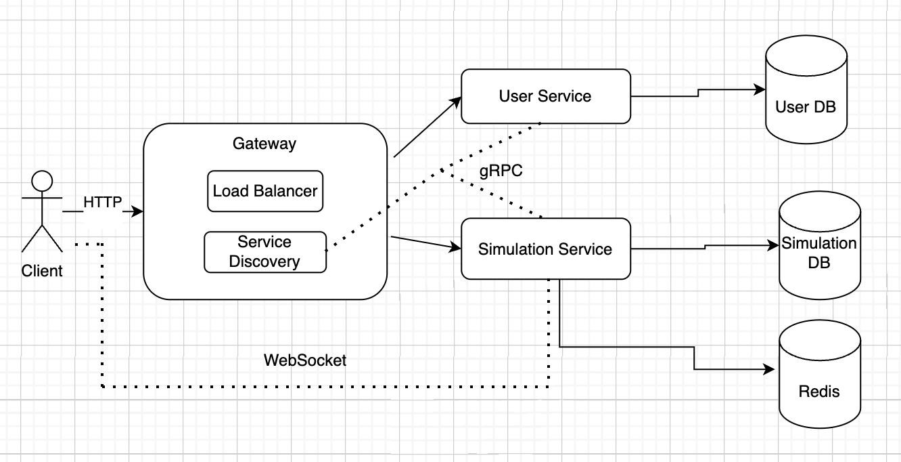

# UnoLingo

#### Ceban Andrei, FAF-211

## Application Suitability
The following system is suitable for the following reasons:

* The Learning Session Service is essential and flexible as it manages core functionalities like matching users with native speakers or tutors, handling conversation sessions (text, voice, or video), and providing real-time feedback during language practice (such as pronunciation correction, vocabulary tips, or grammar suggestions).

* Growing Demand for Language Learning: With increasing globalization, the need to learn new languages for travel, work, or personal growth has surged. Online learning platforms have become a preferred method for language acquisition due to their flexibility and accessibility.

* Real-time Interactions are Critical: Language learning thrives on conversation and immediate feedback. Unlike traditional self-paced apps, this platform offers real-time interactions with native speakers, which provides an immersive learning experience essential for mastering speaking and listening skills.

* Convenience and Accessibility: The app connects learners and native speakers from different regions, offering users the ability to practice anytime and anywhere. This is especially valuable in regions where access to in-person language tutors is limited.

## Service boundaries
